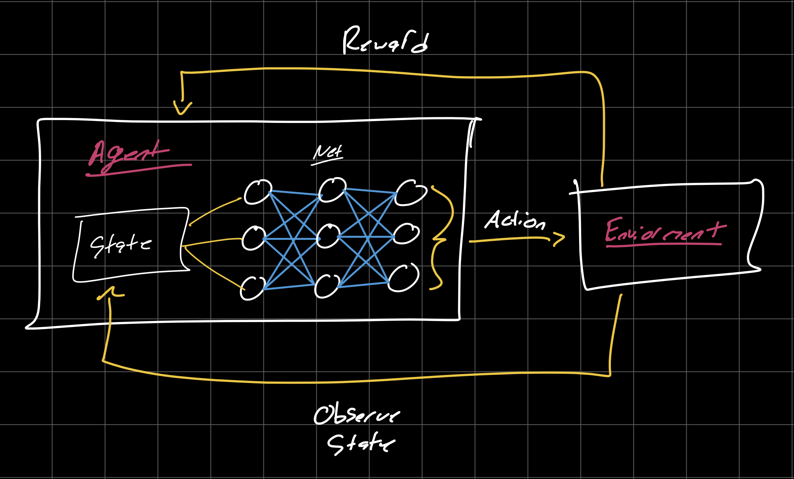
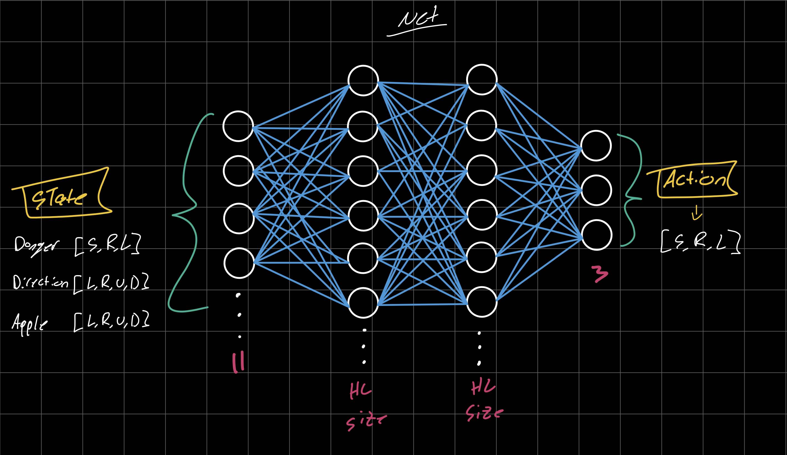
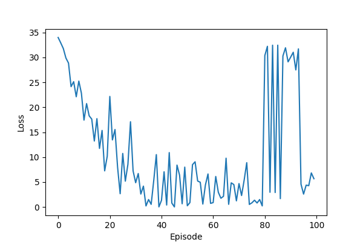
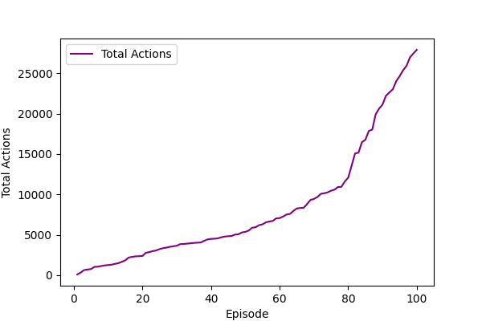
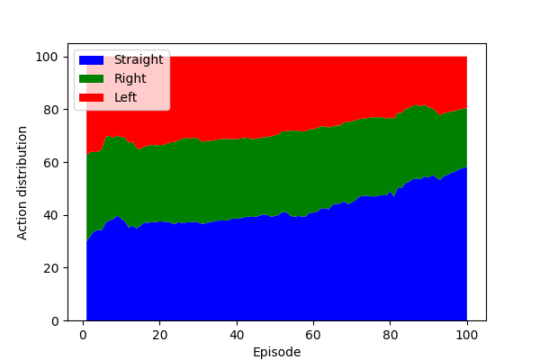
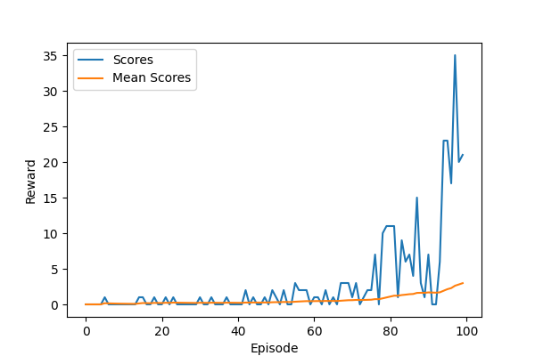
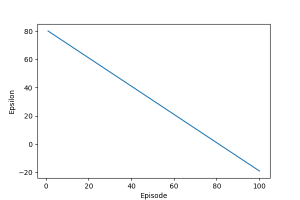

# snake-dql

This repository contains a Python implementation of a Deep Q-Learning (DQL) model that plays a basic Snake arcade game. This algorithm that allows an agent to learn optimal strategies to maximize its cumulative reward in a given environment.

## Training Demo

https://github.com/user-attachments/assets/490d675b-5603-4262-9761-1424ef9d1604

## dql Architecture:

#### Reward System:

Every action the snake takes has the potential for a change in the reward score,
the snake wants to increase its reward at all times and the model trains itself to be the most efficient at this task.

- eat food +10
- Game over -10
- Else 0

0. Init Q value (= init model)
1. Choose action(model.predict(state))
2. Preform action
3. Mesure reward
4. Update Q value (+train model)

#### Model:

The model I use for learning is a simple 2 layer feed forward network defaulting to 256 hidden layer neurons. I wish to continue this project testing with CNN's and vision transformer models.

I currently only have a linear epsilon decay function implemented, I wish to continue by experimenting with other options such as exponential decay and reward based decay.

### Results after 100 episodes

      
      
      
      
      

https://github.com/user-attachments/assets/71ed1b75-293e-4067-8b6c-88b903e0595a

### Class Structure

We have 3 main classes that work together to facilitate the learning: the game, the agent, and the model.

#### `gameUI.py`

Simple user controlled version of the snake game to see the differences between the human brain and the Q learning model.

#### `Agent.py`

This class facilitates the communication between the game and the model and updates the training model. It uses the get_state function to gather information about the game, this state contains the following:
State (11 values):
Danger: [straight, right left]
Current Direction: [left, right, up, down]
Food Mapping: [left, right, up, down]
Then it feeds this state data into the the model using the get_move function, and returns the best move for the snake to take. It then utilizes the model.train() function so the model can update.
-game
-model

#### `game.py`

This class holds the logic for the snake game and controls the GUI. The play_step function takes an action input and uses this to create a snake movement.
This movement is stored as an action:
[1,0,0] -> straight
[0,1,0] -> right turn
[0,0,1] -> left turn
Then it returns the current score, if the game ended (collision), and the reward tally.
play_step(action)
return(reward, game_over, score)

#### `model.py`

This class is utilized to convert our state data into readable snake actions. Using model.predict(state) it can output the best possible snake action.

#### `helper.py`

Contains helper functions to plot metrics.

### Installation

#### 1. Download Repository

      git clone https://github.com/josephjquinn/snake-dql.git

#### 2. Install Dependencies

      pip install -r requirements.txt

#### 3. Run User Mode

      python util/gameUI.py

#### 4. Train Agent -- saved to./output/model.pth

      python main.py
Args

- --model_path: Path to a pre-trained model file. If provided, the script runs in evaluation mode. If not provided, the script runs in training mode.
- --speed: Speed of the game (default: 20).
- --num_episodes: Number of episodes to train for (default: 1000).
      
#### 4. View Metrics

      python view.py ./output/training.csv
