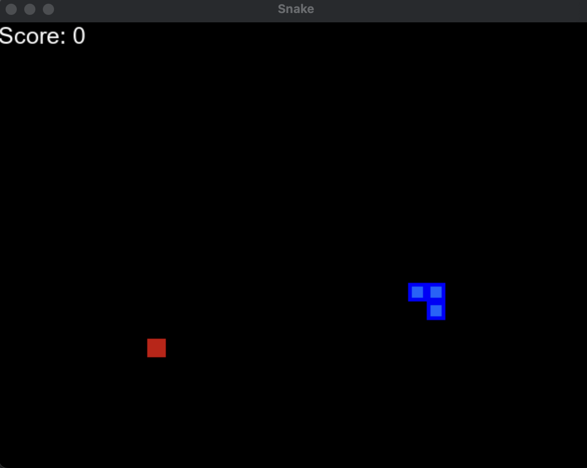
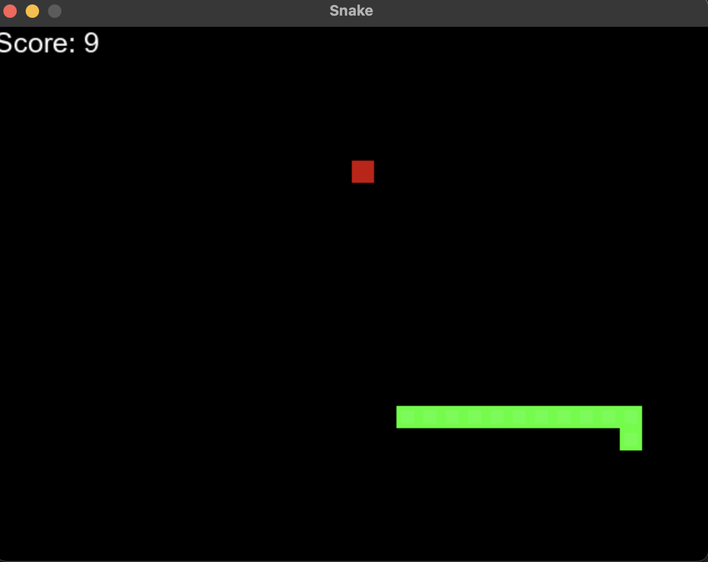
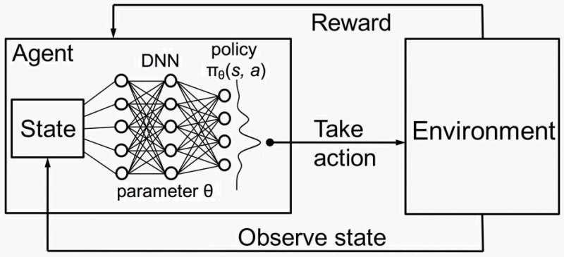
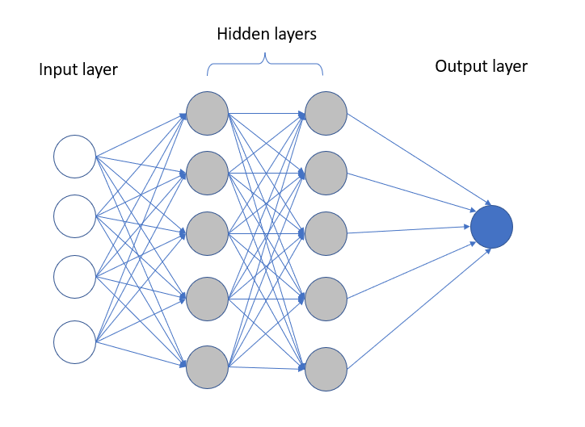
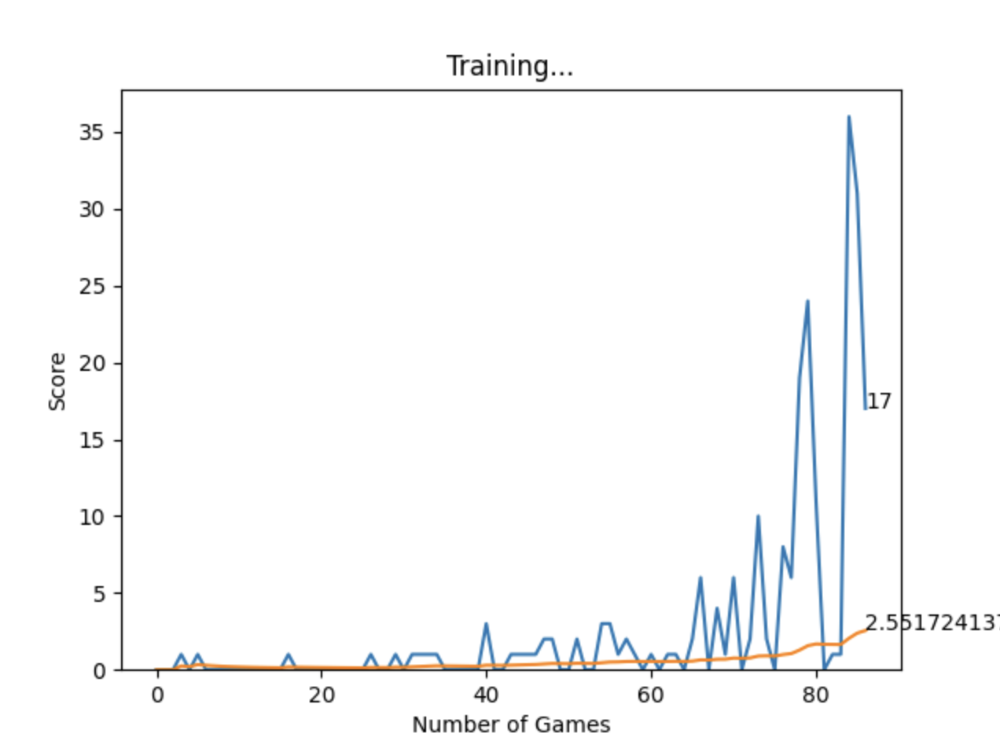
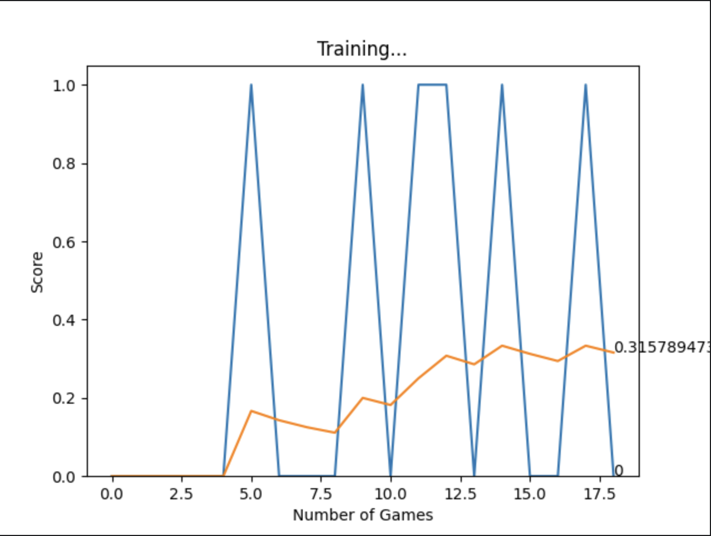

# Snake-Deep-Learning

This repository contains a Python implementation of a Deep Q-Learning (DQL) AI that plays a basic Snake arcade game. Deep Q-Learning is a popular reinforcement learning algorithm that allows an agent to learn optimal strategies to maximize its cumulative reward in a given environment.

In this project, we have trained a DQL agent to control the movements of a Snake in a simple arcade game. The goal of the Snake AI is to collect as many food items as possible while avoiding collisions with the walls and itself.

This repository contains a Python implementation of a Deep Q-Learning (DQL) AI that plays a basic Snake arcade game. Deep Q-Learning is a popular reinforcement learning algorithm that allows an agent to learn optimal strategies to maximize its cumulative reward in a given environment.

In this project, we have trained a DQL agent to control the movements of a Snake in a simple arcade game. The goal of the Snake AI is to collect as many food items as possible while avoiding collisions with the walls and itself.

### Reinforcement Learning: 
The area of machine learning involved with how software agents choose to take actions in an environment in order to maximize their reward.
### Deep Q Learning: 
Extension of RL in utilizing a deep neural network to predict the actions

## Reward System:

This system relies on a reward system in order to train the model, every action the snake takes has the potential for a change in the reward score, 
the snake wants to increase its reward at all times and the model trains itself to be the most effect at this task.
- eat food +10
- Game over -10
- Else 0

## Model: 
### Q Learning -> Q value = Quality of action

### (1-4) LOOP
0. Init Q value (= init model)
1. Choose action(model.predict(state))
2. Preform action
3. Mesure reward
4. Update Q value (+train model)

We have 3 main classes that work together to facilitate the learning: the game, the agent, and the model.

## `gameUI.py`
Simple user controlled version of the snake game to see the differences between the human brain and the Q learning model.

## `Agent.py`
This class facilitates the communication between the game and the model and updates the training model. It uses the get_state function to gather information about the game, this state contains the following:
State (11 values):
Danger: [straight, right left]
Current Direction: [left, right, up, down]
Food Mapping: [left, right, up, down]
Then it feeds this state data into the the model using the get_move function, and returns the best move for the snake to take. It then utilizes the model.train() function so the model can update.
-game
-model

### Training:
get_state(game)
get_move(state)
	model.precict()
Reward, gameover, score = game.play_step(action)
new_state = get_state(game)
Remember
model.train()

## `game.py`
This class holds the logic for the snake game and controls the GUI. The play_step function takes an action input and uses this to create a snake movement. 
This movement is stored as an action:
[1,0,0] -> straight
[0,1,0] -> right turn
[0,0,1] -> left turn
Then it returns the current score, if the game ended (collision), and the reward tally.
play_step(action)
	return(reward, game_over, score)

## `model.py`
This class is utilized to convert our state data into readable snake actions. Using model.predict(state) it can output the best possible snake action. This class utilizes PyTorch to store and read data.
Linear_QNet
Model.predict(state)
	return(action)
 
## `helper.py`
Contains helper functions to plot our data for the user to read.

